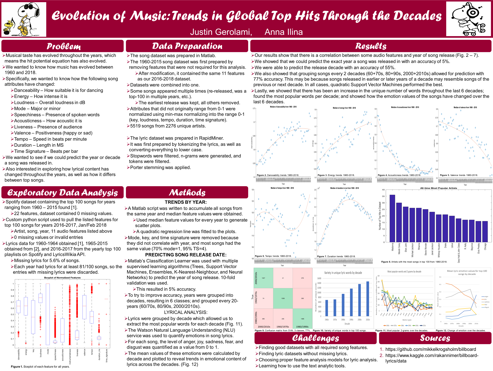

# music data analysis
Project by Anna Ilina and Justin Gerolami

Use Python 2.7.13

In this project, we explore trends in musical elements and lyrics for the top 100 songs from the past six decades.
We perform text analysis on the lyrics, and try to predict a song's year of release, based on its musical elements and lyric emotions.

Data for this project was taken from Kaggle competitions, the Spotify Web API, and lyrics.wikia.com (see poster for links to Kaggle datasets and outcomes of the analysis).
